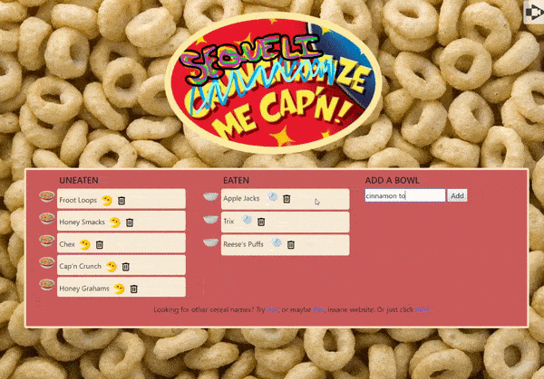

# sequelize-me-captain
A full-stack CRUD cereal tracker made with Sequelize, MySQL, Node, Express, Handlebars using the MVC design pattern.

# goal
Built for practice making a clean and efficient full-stack application, with all that that entails: custom routing, server building, database schema creation, AJAX calls, CRUD operations, jQuery event listeners, a front-end templater, and UI/UX design. The end result is this delightfully silly cereal tracker. Add your favorite cereal to the collection! Mobile friendly.

# instructions
No login required. Simply type in a new cereal name and press enter; refill or eat the bowls with the milk and pac-man symbols, respectively.

# try it yourself!
https://calm-reef-35185.herokuapp.com/

